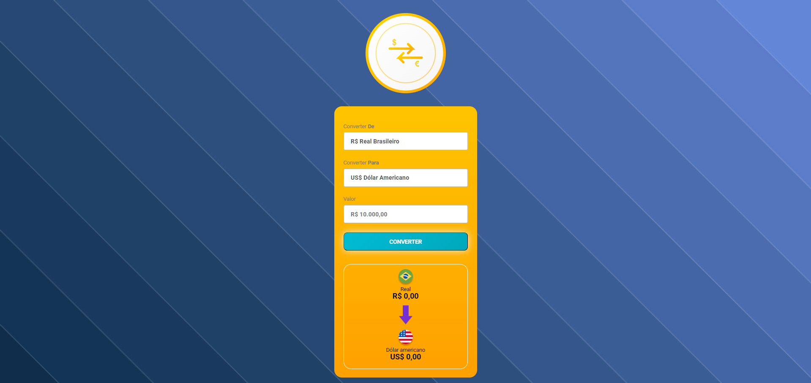

🌎 Conversor de Moedas
 
📋 Descrição do Projeto
 
Este projeto é um Conversor de Moedas desenvolvido como parte do meu aprendizado em programação. O conversor permite que os usuários insiram valores em uma moeda e os convertam para outra moeda utilizando taxas de câmbio fixas para fins de exemplo.

🚀 Funcionalidades
Conversão entre diferentes moedas (BRL, USD, EUR, GBP)

Interface amigável e intuitiva

Atualização das taxas de câmbio ao selecionar a moeda

🛠️ Ferramentas Utilizadas
Linguagens de Programação e Tecnologias
HTML: Estrutura do conteúdo do site.

CSS: Estilização da aparência do site.

JavaScript: Adiciona interatividade e realiza cálculos de conversão de moeda.

APIs e Bibliotecas
Intl.NumberFormat: Utilizado para formatar números como moedas conforme a localidade.

📝 Estrutura do Projeto
Arquivos Principais
index.html: Estrutura principal do site.

style.css: Estilos do site.

script.js: Lógica de conversão e manipulação do DOM.

📷 Imagens do Projeto

Página Inicial

Conversão de Moedas

📚 Aprendizados
Durante o desenvolvimento deste projeto, aprendi sobre:

Estruturação de páginas web com HTML

Estilização utilizando CSS

Manipulação do DOM e interatividade com JavaScript

Formatação de números como moedas com Intl.NumberFormat

🤝 Contribuições
Contribuições são bem-vindas! Se você encontrar bugs ou tiver sugestões de melhorias, sinta-se à vontade para abrir um issue ou enviar um pull request.

vamos ficar em manutenção 

